# How to call code from a running Phoenix app

When using Livebook for internal tools, runbooks or engineering support, a common need is to call code from a running Phoenix app.

In this tutorial, you'll learn how to do that, the building blocks, and some best practices.

## The two approaches to call code from a running app

In a notebook, there are two ways to call code from a running Phoenix app:

- **Standalone runtime**: running specific pieces of code in the context of your Phoenix app via remote procedure calls
- **Attached runtime**: running all code in the context of your Phoenix app

To understand each approach, we first need to understand the concept of a **runtime** in Livebook, which is responsible for evaluating the code of a cell from a notebook.

### Standalone runtime

By default, Livebook starts a new Erlang VM node for each notebook. This is the **standalone runtime**.

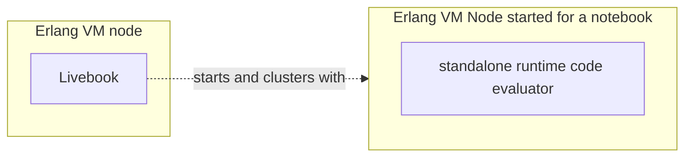

When using the standalone runtime, the code cells of your notebook are evaluated inside the node that Livebook created for that notebook.

Since your Phoenix app is running on another node, you can use remote procedure calls over distributed Erlang to call code from your Phoenix app:

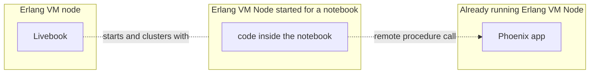

### Attached runtime

There's also the **attached runtime**, which is backed by a node that was started independently of Livebook, for example, a node running a Phoenix app.

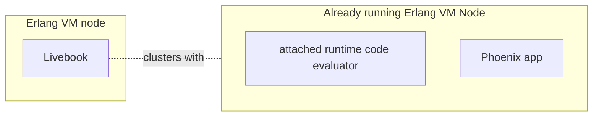

When using the attached runtime, the code cells of your notebook are evaluated inside the same node where your Phoenix app is running. In that context, your code cells can directly call code from your Phoenix app:

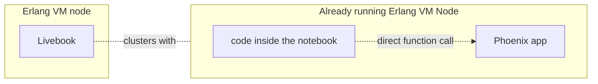

To call code from a running Phoenix app using the attached runtime, you can [follow these instructions](use_cases.md#debugging-live-systems-with-attached-mode).

This tutorial will focus on calling code from a running Phoenix app using the standalone runtime and remote procedure calls.

> #### Calling code from an app: standalone runtime vs attached runtime {: .info}
>
> TO-DO: explain the trade-offs, when to use one versus the other.

## Calling code from a Phoenix app using remote procedure calls

Since a Livebook notebook and a Phoenix app are both Elixir programs running in separate Erlang VM nodes, we can leverage distributed Erlang to integrate a notebook with a Phoenix app.

Let's say your Phoenix app has a `MyApp.Accounts.count_users/0` function. To call that function, first we need to cluster the node running our notebook with the node running our app.

Imagine we have started the Phoenix app with the node name `my_app@127.0.0.1` and the cookie value is `secret`, like this:

```
$ iex --name my_app@127.0.0.1 --cookie secret -S mix phx.server
```

To cluster the node of our notebook with that Phoenix app's node, we can use the `Node` module inside our notebook:

```elixir
phoenix_app_node = :"my_app@127.0.0.1"
phoenix_app_cookie = :secret

Node.set_cookie(phoenix_app_cookie)
Node.connect(phoenix_app_node)
```

After running that code inside your notebook, the notebook's node will be clustered with the node of our Phoenix app. Now we can call the `MyApp.Accounts.count_users/0` function via a remote procedure call using the [`erpc`](https://www.erlang.org/doc/apps/kernel/erpc.html) module:

```elixir
:erpc.call(phoenix_app_node, MyApp.Accounts, :count_users, [])
```

## Clustering with a Phoenix app running in production

So far, we've shown how to cluster with a local Phoenix app using hardcoded values. But in practice, you'll want your notebook to run in different environments - locally during development and remotely in production.

The usual workflow is to develop a notebook locally and then [deploy it as an app to a Livebook app server](deploy_app.md) running in the same infrastructure as the production environment of your Phoenix app.

To support this workflow, we need to make the node name and cookie configurable. We'll use Livebook secrets for those configs. Let's create two secrets:

- `PHOENIX_APP_ENV`: to hold the env name of the Phoenix app
- `PHOENIX_APP_COOKIE`: to hold the value of the cookie of the node running our Phoenix app

For "dev environment", we can use the regular secrets of your Teams organization:

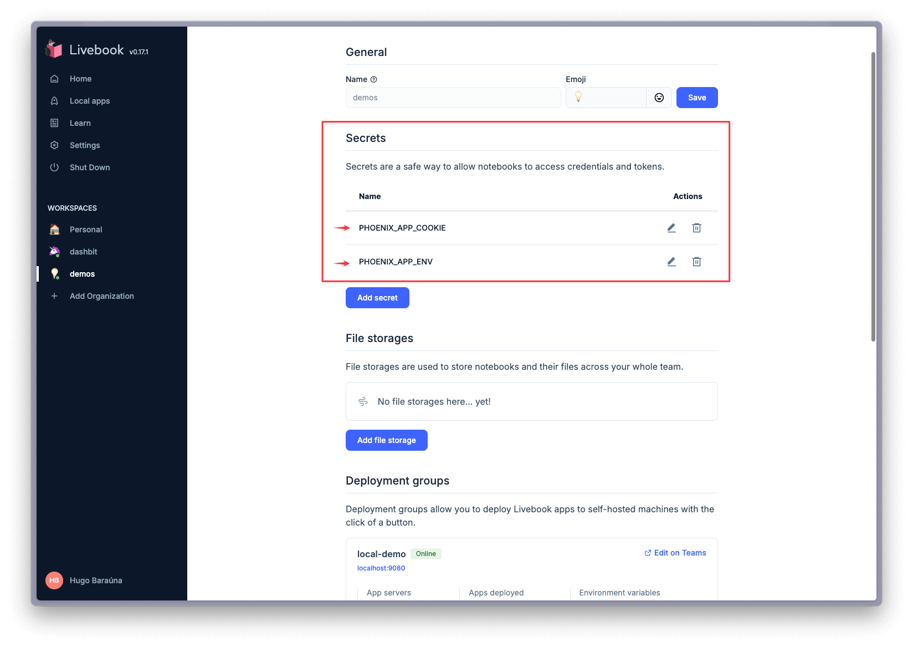

- For the `PHOENIX_APP_ENV`, you can set the value to `dev`
- For the `PHOENIX_APP_COOKIE`, you can set the value to `secret` (or whichever other cookie value you're going to use in localhost dev)

For the "production environment", we can use the "additional secrets" feature from deployment groups to override each of those secrets for the deployment group of your production environment:

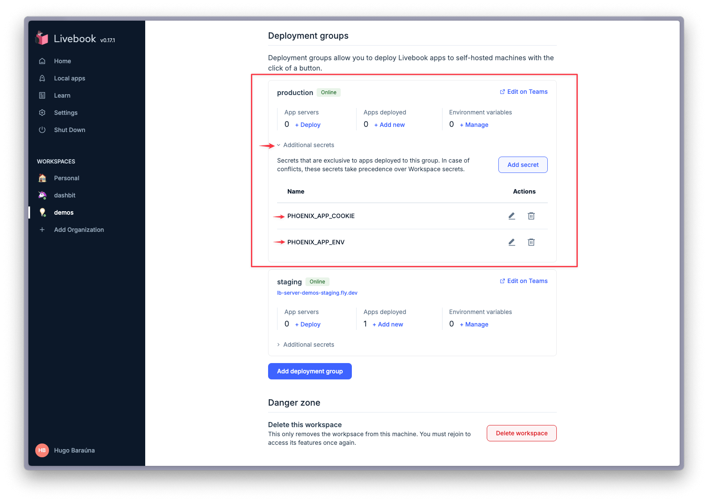

- For the `PHOENIX_APP_ENV`, you can set the value to `production`
- For the `PHOENIX_APP_COOKIE`, set the value to the cookie of your app's node in production

Once we have those secrets defined, we can use them to cluster our notebook with our Phoenix app
either in dev or in production. Copy that module to your notebook:

```elixir
defmodule NodeConnection do
  def connect() do
    Node.set_cookie(cookie())

    case Node.connect(target_node()) do
      true -> :ok
      _ -> {:error, "Failed to connect to #{inspect(target_node())}"}
    end
  end

  def cookie() do
    String.to_atom(System.fetch_env!("LB_PHOENIX_APP_COOKIE"))
  end

  def target_node() do
    case System.fetch_env!("LB_PHOENIX_APP_ENV") do
      "dev" ->
        :"my_app@127.0.0.1"
      env when env in ["staging", "production"] ->
        discover_node()
    end
  end

  defp discover_node() do
    # return the node of your Phoenix app, depending on how and where it's deployed
  end
end

NodeConnection.connect()
```


## Clustering configurations

We learned that to cluster a notebook with a running Phoenix app, we need the name and cookie of the node where that app is running. Here's how you can get those.

### Cookie

In development, you can control the value of the cookie via the `--cookie` option when starting your Phoenix app:

```
$ iex --name my_app@127.0.0.1 --cookie secret -S mix phx.server
```

In production, the cookie is set differently and depends on how you're deploying your app. That said, make sure the cookie value is static, and use that value to set the cookie secret when clustering your notebook with your app.

For example, let's say you're using Elixir's releases for the deployment of your app. By default, the cookie is dynamically generated when the release is created. To make it static, set a value to the environment variable `RELEASE_COOKIE` in the machines where your app is being deployed and restart or redeploy your app.

You can learn more about [confiruring a cookie in Elixir's releases here](https://hexdocs.pm/mix/Mix.Tasks.Release.html#module-options).

### Node name config

Livebook always runs using long names distribution, so the node of your Phoenix app must use the long name config as well.

Let's say you're using Elixir's releases for the deployment of your app. You can set that config in the `rel/env.sh.eex` file of your app like this:


```
# rel/env.sh.eex

export RELEASE_DISTRIBUTION=name
```


## Node name discovery

In production, the node names of your Phoenix app are likely dynamic. So, to cluster a notebook with them, you need to programatically discover that name.

The name and the IP/hostname of your app's node depend on where you're deploying your app. Given your app is already configured to use distributed Erlang, and you're using Elixir's releases, you have a config similar to that inside the  `rel/env.sh.eex` file:

```
# rel/env.sh.eex

export RELEASE_DISTRIBUTION="name"
export RELEASE_NODE="app-${PLATFORM_DEPLOYMENT_SHA}@${PLATFORM_DEPLOYMENT_IP}"
```

The value of the `RELEASE_NODE` env var is what you need to discover programmatically, and that is dependent on how this is set for your context and where you're deploying your app.

Let's see an example.

### Node name discovery on Fly.io

When deploying a Phoenix app to Fly.io, the default way `RELEASE_NODE` is configured looks like that:

```
# rel/env.sh.eex

export RELEASE_NODE="${FLY_APP_NAME}-${FLY_IMAGE_REF##*-}@${FLY_PRIVATE_IP}"
```

Let's. write a module that will use Fly's API to discover that node name, and use that module inside our notebook.

First, go to your Fly account, and generate an API token. Second, get the name of your Fly app. Now, save both of those values inside Livebook secrets of your Teams organization using the following names:

- `FLY_TOKEN`
- `FLY_APP`

Now, copy the module below to your notebook:

```elixir
defmodule Fly do
  def discover_node() do
    {:ok, [fly_machine | _]} = Fly.machines(fly_app_name())
    ip = fly_machine["private_ip"]
    :"#{fly_app_name()}-#{extract_image_id(fly_machine)}@#{ip}"
  end

  def machines(fly_app_name) do
    case Req.get(new(), url: "/v1/apps/#{fly_app_name}/machines") do
      {:ok, %Req.Response{status: 200} = response} ->
        {:ok, response.body}

      {:ok, %Req.Response{status: status, body: body}} ->
        {:error,
         "Error when calling Fly API.\n HTTP response status: #{status}\n HTTP response body: \n\t#{body}"}

      {:error, exception} ->
        {:error, "Exception calling Fly API: #{inspect(exception)}"}
    end
  end

  def new() do
    Req.new(
      base_url: "https://api.machines.dev",
      auth: {:bearer, System.fetch_env!("LB_FLY_TOKEN")}
    )
  end

  defp extract_image_id(fly_machine) do
    image_tag = fly_machine["image_ref"]["tag"]
    [image_id] = Regex.run(~r/.*-(.*)/, image_tag, capture: :all_but_first)
    image_id
  end

  defp fly_app_name do
    System.fetch_env!("LB_FLY_APP")
  end
end
```

Notice that the `Fly` module is using `Req`, so you need to add `Req` as dependency of your notebook.

Now we can use that `Fly.discover_node/0` function inside the `NodeConnection. discover_node/0` function:

```elixir
defmodule NodeConnection do
  def connect() do
    Node.set_cookie(cookie())

    case Node.connect(target_node()) do
      true -> :ok
      _ -> {:error, "Failed to connect to #{inspect(target_node())}"}
    end
  end

  def cookie() do
    String.to_atom(System.fetch_env!("LB_PHOENIX_APP_COOKIE"))
  end

  def target_node() do
    case System.fetch_env!("LB_PHOENIX_APP_ENV") do
      "dev" ->
        :"my_app@127.0.0.1"
      env when env in ["staging", "production"] ->
        discover_node()
    end
  end

  defp discover_node() do
    # We're using the Fly module here for discovering the phoenix app node name
    Fly.discover_node()
  end
end

NodeConnection.connect()
```

## Conveniences for working with remote code

When working with remote code (code defined in a remote node), Livebook offers two mechanisms that improve the developer experience.

### Remote execution smart cell

The remote execution smart cell is a built-in smart cell that simplifies calling functions from remote Elixir nodes. Here's what it gives you.

First, instead of needing to use the `Node` module yourself to connect to the remote node, you
can set the node name and cookie as configs inside that smart cell.

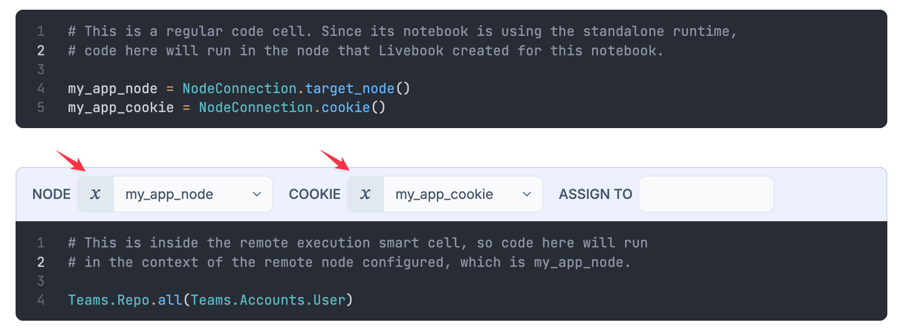

Second, it gives you autocomplete for the remote code. Which makes it much easier to explore and work with the remote codebase directly from your notebook.

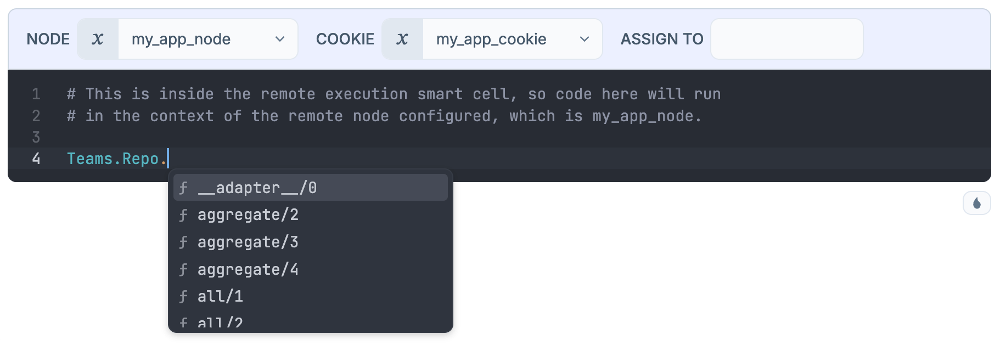

Third, instead of writing one `:erpc.call` per remote function call, you can run multiple lines of code in the context of the remote node.

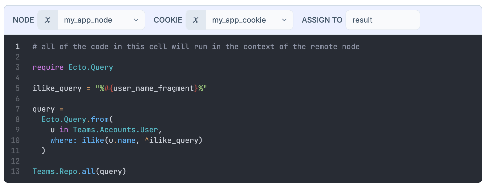

Fourth, code inside the remote cell can reference "local variables" from the cells before, and
assign the value of the last line to a variable, so subsequent cells can use the result of the
remote cell:

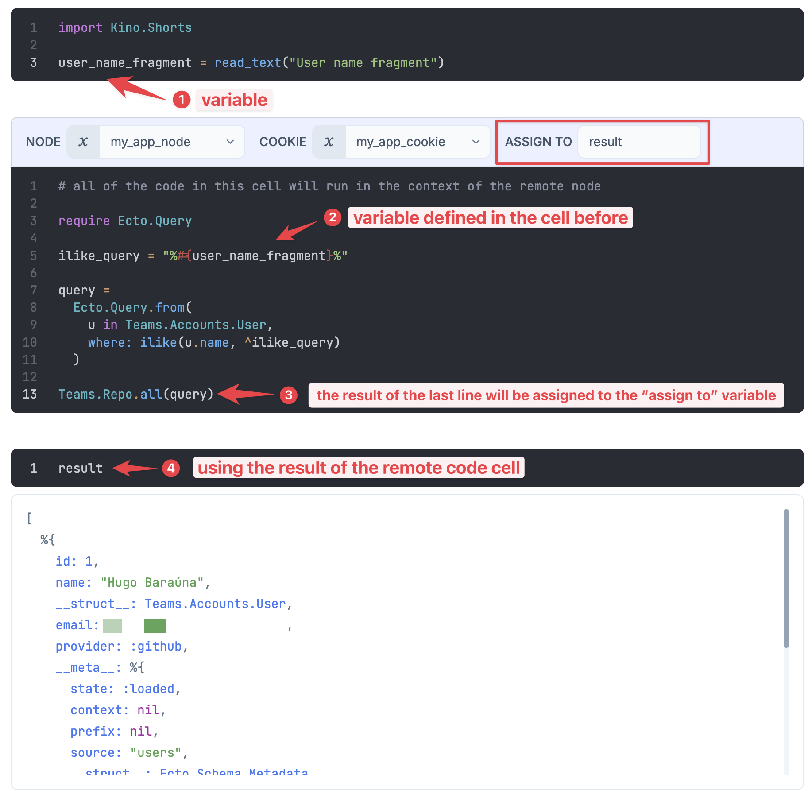

### Kino.RPC

If you need more flexibility than what the remote execution smart cell gives you, you can direcly use the same mechanism it uses behind the scences, the [`Kino.RPC`](https://hexdocs.pm/kino/Kino.RPC.html) module. Let's see an example.

Let's say you're building a simple Livebook app to show the number of users of your Phoenix app per status. Imagine your Phoenix app has a function like this, `MyApp.Users.count_by_status/1`.

You can call that remote function using the remote execution smart cell:

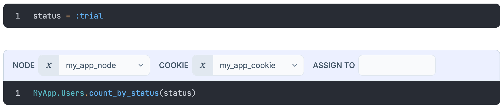

But what if we want the `status` variable to be something that's an input of the user of your Livebook app? Like in this form:

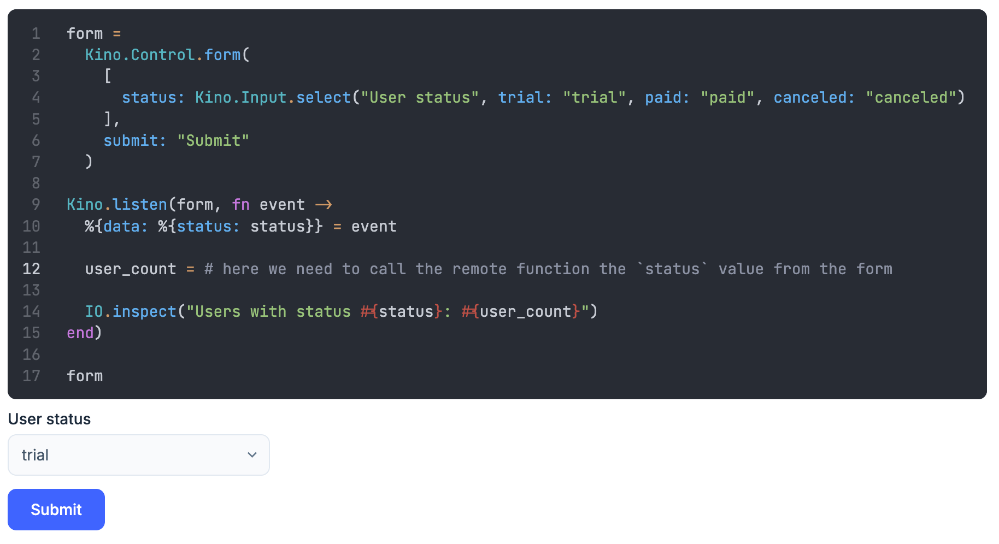

Now we need a way to call the `MyApp.Users.count_by_status/1` remote function passing an argument
that's coming from the form.

In order do that, first we can convert our remote execution smart cell into a regular code cell. If you click in the smart cell, you'll see there's a pencil icon saying "Convert to Code cell":

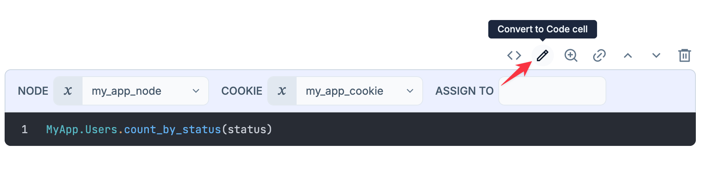

Once you convert the smart cell into a code cell, you'll see this is the code it was generating:

```elixir
require Kino.RPC
node = my_app_node
Node.set_cookie(node, my_app_cookie)
Kino.RPC.eval_string(node, ~S"MyApp.Users.count_by_status(status)", file: __ENV__.file)
```

We can extract that code into a module and function, so we can pass the `status` value as an
argument. Here's one way to do this:

```elixir
Node.set_cookie(my_app_node, my_app_cookie)

defmodule MyAppRPC.Users do
  require Kino.RPC

  def count_by_status(node, status) do
    Kino.RPC.eval_string(node, ~S"MyApp.Users.count_by_status(status)", file: __ENV__.file)
  end
end
```

Now we can use that module in our form, so that when the form is submitted, the status coming
from the form will be used in the remote call:

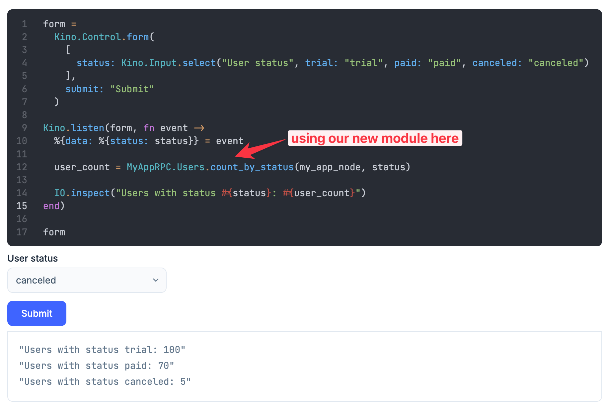
