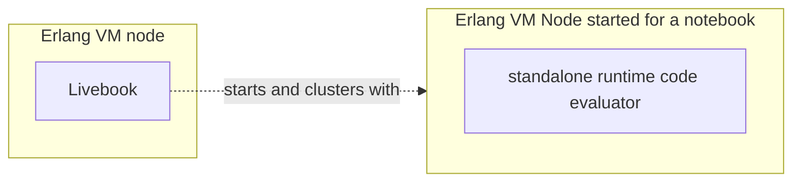
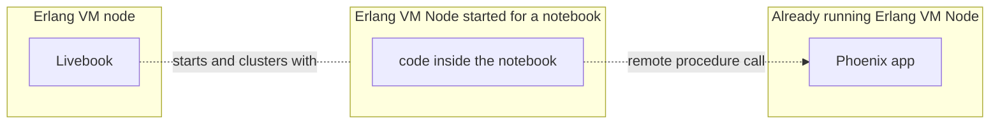
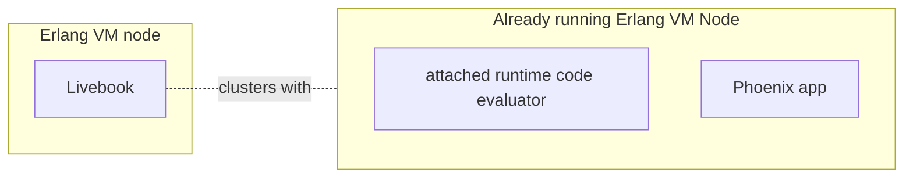
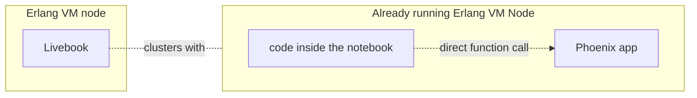

# How to call code from a running Phoenix app

When using Livebook for internal tools, runbooks or engineering support, a common need is to call code from a running Phoenix app.

In this tutorial, you'll learn how to do that, the building blocks, and some best practices.

## The two approaches to call code from a running app

In a Livebook notebook, there are two ways to call code from a running Phoenix app:

- **Standalone runtime**: running specific pieces of code in the context of your Phoenix app via remote procedure calls
- **Attached runtime**: running all code in the context of your Phoenix app

To understand each approach, we first need to understand the concept of a **runtime** in Livebook, which is responsible for evaluating the code of a cell from a notebook.

### Standalone runtime

By default, Livebook starts a new Erlang VM node for each notebook. This is the **standalone runtime**.



When using the standalone runtime, the code cells of your notebook are evaluated inside the node that Livebook created for that notebook.

Since your Phoenix app is running on another node, you can use remote procedure calls over distributed Erlang to call code from your Phoenix app:



### Attached runtime

There's also the **attached runtime**, which is backed by a node that was started independently of Livebook, for example, a node running a Phoenix app.



When using the attached runtime, the code cells of your notebook are evaluated inside the same node where your Phoenix app is running. In that context, your code cells can directly call code from your Phoenix app:



To call code from a running Phoenix app using the attached runtime, you can [follow these instructions](use_cases.md#debugging-live-systems-with-attached-mode).

This tutorial will focus on calling code from a running Phoenix app using the standalone runtime and remote procedure calls.

> #### Calling code from an app: standalone runtime vs attached runtime {: .info}
>
> TO-DO: explain the trade-offs, when to use one versus the other.

## Calling code from a Phoenix app using remote procedure calls

Since a Livebook notebook and a Phoenix app are both Elixir programs running in separate Erlang VM nodes, we can leverage distributed Erlang to integrate a notebook with a Phoenix app.

Let's say your Phoenix app has a `MyApp.Accounts.count_users/0` function. To call that function, first we need to cluster the node running our notebook with the node running our app.

Imagine we have started the Phoenix app with the node name `my_app@127.0.0.1` and the cookie value is `secret`, like this:

```
$ iex --name my_app@127.0.0.1 --cookie secret -S mix phx.server
```

To cluster the node of our notebook with that Phoenix app's node, we can use the `Node` module inside our notebook:

```elixir
phoenix_app_node = :"my_app@127.0.0.1"
phoenix_app_cookie = :secret

Node.set_cookie(phoenix_app_cookie)
Node.connect(phoenix_app_node)
```

Once this runs inside the notebook, the notebook's node will be clustered with the node of our Phoenix app. Now we can call `MyApp.Accounts.count_users/0` using remote procedure calls via the [`erpc`](https://www.erlang.org/doc/apps/kernel/erpc.html) module:

```elixir
:erpc.call(phoenix_app_node, MyApp.Accounts, :count_users, [])
```

## Clustering with a Phoenix app running in production

So far, we've shown how to cluster with a local Phoenix app using hardcoded values. But in practice, you'll want your notebook to work in different environments - locally during development and in production.

The usual workflow is to develop a notebook locally and then deploy it as an app to a Livebook app server running in the same infrastructure as the production environment of your Phoenix app.

To support this workflow, we need to make the node name and cookie configurable. We'll use Livebook secrets for those configs.

We'll use two secrets:

- `PHOENIX_APP_ENV`: to hold the env name of the Phoenix app
- `PHOENIX_APP_COOKIE`: to hold the value of the cookie of the node running our Phoenix app

To have a different value for each of those two secrets, you can leverage the "additional secrets" feature from deployment groups. The setup would work like this:

You can store the values for "dev environment" inside the regular secrets of your Teams organization:


- For the `PHOENIX_APP_ENV`, you can store the value `dev`
- For the `PHOENIX_APP_COOKIE`, you can store the value `secret` (or whichever other cookie value you're going to use in localhost dev)

And then, you can override each of those secrets for the deployment groups of your production and staging environment:


- For the `PHOENIX_APP_ENV`, you can store the value `production`
- For the `PHOENIX_APP_COOKIE`, you can store the value of the secret of your app in production

Once we have those secrets defined, we can use them to dynamically define the cookie and node name for the clustering:

```elixir
defmodule NodeConnection do
  def connect() do
    Node.set_cookie(cookie())

    case Node.connect(target_node()) do
      true -> :ok
      _ -> {:error, "Failed to connect to #{inspect(target_node())}"}
    end
  end
  
  def cookie() do
    String.to_atom(System.fetch_env!("LB_PHOENIX_APP_COOKIE"))
  end

  def target_node() do
    case System.fetch_env!("LB_PHOENIX_APP_ENV") do
      "dev" ->
        :"my_app@127.0.0.1"
      env when env in ["staging", "production"] ->
        discover_node()
    end
  end

  defp discover_node() do
    # return the node of your Phoenix app, depending on how and where it's deployed
  end
end

NodeConnection.connect()
```


## Clustering configurations

We learned that to cluster a notebook with a running Phoenix app, we need the name and cookie of the node where that app is running. Here's how you can get those.

### Cookie

In development, you can control the value of the cookie via the `--cookie` option when starting your Phoenix app:

```
$ iex --name my_app@127.0.0.1 --cookie secret -S mix phx.server
```

In production, the cookie is set differently and depends on how you're deploying your app. That said, make sure the cookie value is static, and use that value as the cookie config when clustering your notebook with your app.

For example, let's say you're using Elixir's releases for the deployment of your app. By default, the cookie is dynamically generated when the release is created. To make it static, set a value to the environment variable `RELEASE_COOKIE` in the machines where your app is being deployed and restart or redeploy your app.

### Node name config

Livebook always runs using long names distribution, so the node of your Phoenix app must use the long name config as well.

Let's say you're using Elixir's releases for the deployment of your app. You can set that config in the `rel/env.sh.eex` file of your app like this:


```
# rel/env.sh.eex
export RELEASE_DISTRIBUTION=name
```


## Node name discovery

In production, the node names of your Phoenix app are likely dynamic. So, to cluster a notebook with them, you need to discover that name.

The name and the IP/hostname of your app's node depend on where you're deploying your app. Given you're app is already configured to use distributed Erlang, and you're using Elixir's releases, you have a config similar to that inside the  `rel/env.sh.eex` file:

```
# rel/env.sh.eex

export RELEASE_DISTRIBUTION="name"
export RELEASE_NODE="app-${PLATFORM_DEPLOYMENT_SHA}@${PLATFORM_DEPLOYMENT_IP}"
```

The value of the `RELEASE_NODE` env var is what you need to discover programmatically, and that is dependent on how this is set for your context and where you're deploying your app.

Let's see an example.

### Node name discovery on Fly.io

When deploying a Phoenix app to Fly.io, the default value `RELEASE_NODE` is configured like this by default:

```
# rel/env.sh.eex

export RELEASE_NODE="${FLY_APP_NAME}-${FLY_IMAGE_REF##*-}@${FLY_PRIVATE_IP}"
```

We can create a simple module that will use Fly's API to get that, and use that module inside our notebook.

First, go to your Fly account, and generate an API token. Save that inside a Livebook secret of of Teams organization using the name `FLY_TOKEN`.

Now, copy the following module to your notebook:

```elixir
defmodule Fly do
  def discover_node() do
    {:ok, [fly_machine | _]} = Fly.machines(fly_app_name())
    ip = fly_machine["private_ip"]
    :"#{fly_app_name()}-#{extract_image_id(fly_machine)}@#{ip}"
  end

  def machines(fly_app_name) do
    case Req.get(new(), url: "/v1/apps/#{fly_app_name}/machines") do
      {:ok, %Req.Response{status: 200} = response} ->
        {:ok, response.body}

      {:ok, %Req.Response{status: status, body: body}} ->
        {:error,
         "Error when calling Fly API.\n HTTP response status: #{status}\n HTTP response body: \n\t#{body}"}

      {:error, exception} ->
        {:error, "Exception calling Fly API: #{inspect(exception)}"}
    end
  end

  def new() do
    Req.new(
      base_url: "https://api.machines.dev",
      auth: {:bearer, System.fetch_env!("LB_FLY_TOKEN")}
    )
  end

  defp extract_image_id(fly_machine) do
    image_tag = fly_machine["image_ref"]["tag"]
    [image_id] = Regex.run(~r/.*-(.*)/, image_tag, capture: :all_but_first)
    image_id
  end

  defp fly_app_name do
    System.fetch_env!("LB_TEAMS_FLY_APP")
  end
end
```

Now we can use that when for clustering, by calling the `Fly.discover_node/0` function from our `NodeConnection` module:

```elixir
defmodule NodeConnection do
  def connect() do
    Node.set_cookie(cookie())

    case Node.connect(target_node()) do
      true -> :ok
      _ -> {:error, "Failed to connect to #{inspect(target_node())}"}
    end
  end
  
  def cookie() do
    String.to_atom(System.fetch_env!("LB_PHOENIX_APP_COOKIE"))
  end

  def target_node() do
    case System.fetch_env!("LB_PHOENIX_APP_ENV") do
      "dev" ->
        :"my_app@127.0.0.1"
      env when env in ["staging", "production"] ->
        discover_node()
    end
  end

  defp discover_node() do
    discover_node()
  end
end

NodeConnection.connect()
```

## Remote execution smart cell

TO-DO
- smart execution cell
- what is executing where

## Kino.RPC

TO-DO