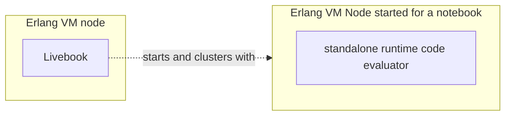
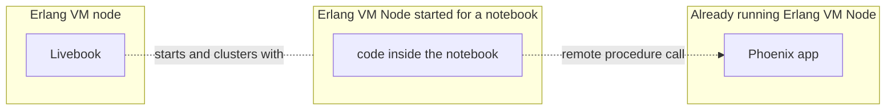
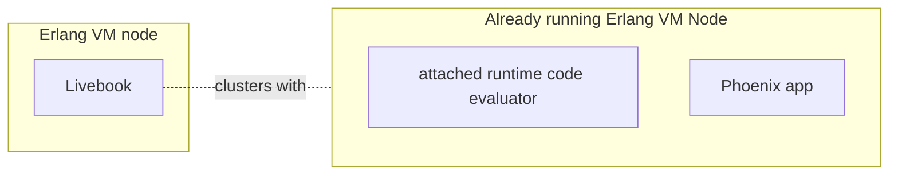
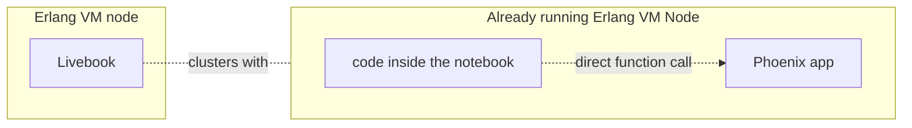

# How to call code from a running Phoenix app

When using Livebook for internal tools, runbooks or engineering support, a common need is to
call code from a running Phoenix app.

In this tutorial, you'll learn how to do that, the building blocks, and some best practices.

## The two approaches to call code from a running app

In a Livebook notebook, there are two ways to call code from a running Phoenix app:

- running specific pieces of code in the context of your Phoenix app (via standalone runtime)
- running all code in the context of your Phoenix app (via attached runtime)

To understand each one, we first need to understand the concept of a **runtime** in Livebook, which is responsible for evaluating the code of a cell from a notebook.

### Standalone runtime

By default, Livebook starts a new Erlang VM node for each notebook. This is the **standalone runtime**.



When using the standalone runtime, the code cells of your notebook are evaluated inside the node that Livebook created for that notebook.

Given your Phoenix app is running on another node, you can use remote procedure calls over Erlang distributed to call code from your Phoenix app:



### Attached runtime

There's also the **attached runtime**, which is backed by a node that was started independently of  Livebook, for example, a node running a Phoenix app.



When using the attached runtime, the code cells of your notebook are evaluated inside the same node where your Phoenix app is running. So in that context, your code cells can directly call code from your Phoenix app:



To call code from a running Phoenix app using the attached runtime, you can [follow these instructions](use_cases.md#debugging-live-systems-with-attached-mode).

This tutorial will focus on calling code from a running Phoenix app using the standalone runtime and remote procedure calls.

> #### Calling code from an app: standalone runtime X attached runtime {: .info}
>
> TO-DO: explain the trade-offs, when to use one versus the other.

## Calling code from a Phoenix app using remote procedure calls

Given that the notebook and the Phoenix app are both Elixir programs running in separate Erlang VM nodes, we can leverage Erlang distributed to integrate a notebook with a Phoenix app. 

Let's say your Phoenix app has a `MyApp.Accounts.count_users()` function. To call that function, first we need to cluster the node running our notebook with the node running our app.

Imagine we have started the Phoenix app with the node name `my_app@127.0.0.1` and the cookie value is `secret`, like this:

```console
$ iex --name my_app@127.0.0.1 --cookie secret -S mix phx.server
```

To cluster the node of our notebook with that Phoenix app's node, we can use the `Node` module inside our notebook:

```
phoenix_app_node = :"my_app@127.0.0.1"
phoenix_app_cookie = :secret

Node.set_cookie(phoenix_app_cookie)
Node.connect(phoenix_app_node)
```

Once this is run inside the notebook, the notebook's node will be clustered with the node of our Phoenix app. Now we can call the `MyApp.Accounts.count_users()` using remote procedure calls via the [`erpc`](https://www.erlang.org/doc/apps/kernel/erpc.html) module like this:

```elixir
:erpc.call(phoenix_app_node, MyApp.Accounts, :count_users, [])
```

## Clustering with a Phoenix app running in production

The usual workflow is to develop a notebook locally and then deploy it as an app to a Livebook app server running in the same infrastructure as the production environment of your Phoenix app, so that the notebook can run both locally and in production.

In that context, we need to have a way to configure the node name and cookie of your Phoenix app based on an environment variable. To that, we'll Livebook secrets.

We'll define secrets:

- `PHOENIX_APP_ENV`: to hold the env name of the Phoenix app
- `PHOENIX_APP_COOKIE`: to hold the value of the cookie of the node running our Phoenix app

Once we have that defined, we can use that to dinamically cluster our notebook with the Phoenix app, like that:


```elixir
defmodule NodeConnection do
  def connect() do
    cookie = String.to_atom(System.fetch_env!("LB_PHOENIX_APP_COOKIE"))
    Node.set_cookie(cookie)
    
    case Node.connect(target_node()) do
      true -> :ok
      _ -> {:error, "Failed to connect to #{inspect(target_node())}"}
    end
  end

  def target_node() do
    case System.fetch_env!("LB_PHOENIX_APP_ENV") do
      "dev" -> 
        :"teams@127.0.0.1"
      env when env in ["staging", "prod"] -> 
        discover_node()
    end
  end

  defp discover_node() do
    # return the node of your phoenix app, depending on how and where it's deployed
  end
end

NodeConnection.connect()
```


## Node discovery

## Running local code and remote code
- smart execution cell
- what is executing where
