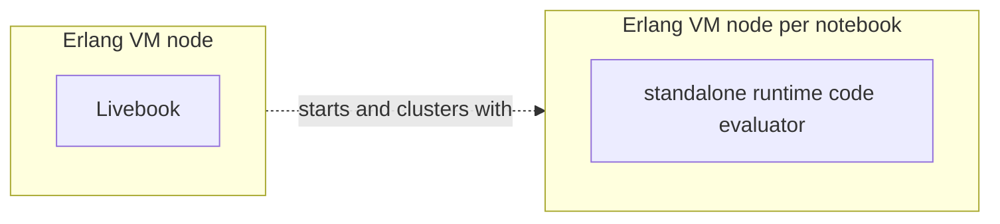
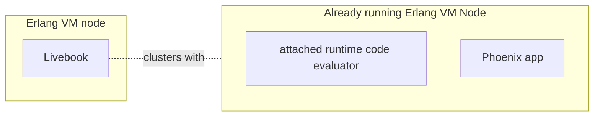
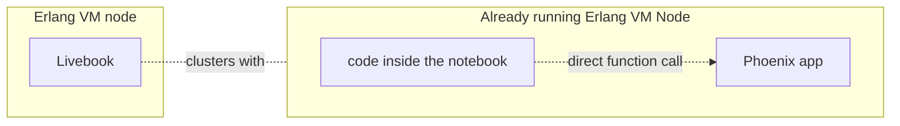

# Livebook runtimes

A Livebook runtime consists of a set of processes responsible for evaluating notebook code.

Livebook offers four types of runtimes:

- Standalone
- Attached node
- Fly.io
- Kubernetes Pod

## Standalone runtime

By default, Livebook starts a new Erlang VM node for each notebook. This is the standalone runtime.

The code inside your notebook runs in the context of this specific node started for your notebook, isolated from Livebook and other running notebook sessions.

Since your notebook has its own node, it can declare its own Hex package dependencies via `Mix.install/2`.

## Attached runtime

The attached runtime connects to an existing Elixir node managed outside of Livebook, such as a node running a Phoenix application.

When using the attached runtime, your notebook's code cells execute within the same node as the external application. This is similar to attaching an IEx session to a running node.

Since your notebook code runs within the external node's context, your code cells can directly call any function defined in the remote node:

However, your notebook cannot have its own Hex package dependencies, it only has access to what's already loaded in the external node.

## Fly.io runtime

The Fly.io runtime provisions a new Erlang VM instance on Fly.io infrastructure to run your notebook code.

This runtime uses a Livebook-managed Elixir node, similar to the standalone runtime, but runs on a temporary Fly.io machine that automatically shuts down when the runtime is disconnected.

You'll need your own Fly.io account to use this runtime.

## Kubernetes runtime

The Kubernetes runtime starts a new pod within a Kubernetes cluster to execute your notebook code.

This runtime creates a Livebook-managed Elixir node that runs on a temporary Kubernetes pod.

The runtime uses `kubectl` to proxy a local port to the distribution port of the remote node, enabling communication between your local Livebook instance and the pod running in the cluster.

The pod automatically terminates when the runtime is disconnected.
